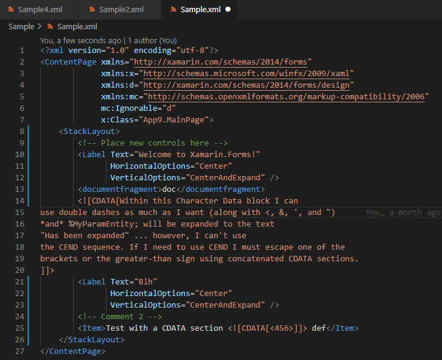

# Pretty XML

Pretty XML is a XML formatter extension for Visual Studio Code and VSCodium. It formats XML documents just like Visual Studio on Windows.
**Supported file extensions**: xml, xaml, xsd, xsl, plist, mobileconfig, config, csproj, axml, resx and all other XML type of files.

There is also **Visual Studio for Mac** version of this extension. Check it out at [PrettyXML.VSMac](https://github.com/pmahend1/PrettyXML.VSMac)  

Suggestions , improvement PRs are welcome.

   

 

---

## Features

1. ### Prettify XML (XML Formatting)

   Right Click and Select Prettify XML or use [shortcut](#keyboard-shortcuts)

   - First attribute on same line as start tag.
   - All attributes indented in line with first attribute.
   - If no child for an element then close inline end tag.(Setting)
   - No empty lines.

2. ### Pretty XML: Minimize

   Minimizes XML.

## GIFs

### Prettify XML

### PrettyXML: Minimize

## Keyboard Shortcuts

| Command             | Platform       | Shortcut         |
|---------------------|----------------|------------------|
| Prettify XML        | Mac            | **Cmd+K L**      |
| Prettify XML        | Windows, Linux | **Control+K L**  |
| PrettyXML: Minimize | Mac            | **Cmd+K \`**     |
| PrettyXML: Minimize | Windows, Linux | **Control+K \`** |

## Formatted Document Example

## Settings

These will be for **Prettify XML** command.

| Setting Key                          | Default Value | Description                                |
|--------------------------------------|---------------|--------------------------------------------|
| prettyxml.settings.indentSpaceLength | 2             | No. of spaces for indentation.             |
| prettyxml.settings.useSingleQuotes   | false         | Use ' instead of \"                        |
| prettyxml.settings.useSelfClosingTag | true          | If no child nodes then self closing tag /> |
| prettyxml.settings.formatOnSave      | false         | Enable format on save                      |

## Requirements

VS Code 1.47 or higher.

## Installation

Visual Studio Code - [Visual Studio MarketPlace](https://marketplace.visualstudio.com/items?itemName=PrateekMahendrakar.prettyxml)

For VSCodium - [open-vsx.org](https://open-vsx.org/extension/PrateekMahendrakar/prettyxml)

> **Important!**
> 
> You will need .Net SDK or Mono installed on your machine.

## Known Issues

Limited DTD support.
Issues can be reported at [issues section](https://github.com/pmahend1/PrettyXML/issues)

## Release Notes

See [Change Log](./CHANGELOG.md)

### For more information

- [Source Code](https://github.com/pmahend1/prettyxml)

