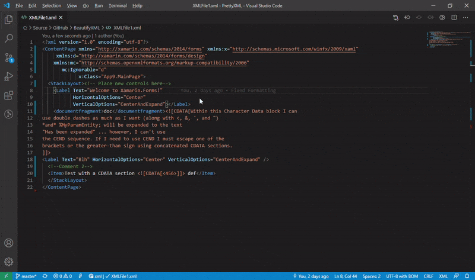
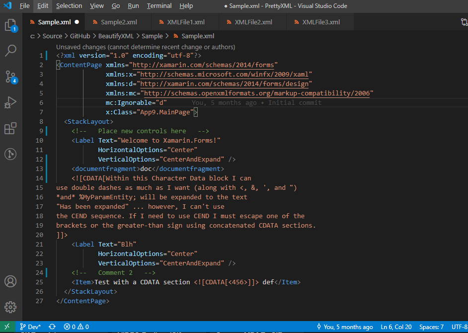

  

# Pretty XML

Pretty XML is a XML formatter extension for Visual Studio Code. It formats XML documents just like Visual Studio. This is in preview mode. Suggestions , improvement PRs are welcome.

## Features

### Prettify XML (XML Formatting) :   

Right Click and Select Prettify XML.

- First attribute on same line as start tag.
- All attributes indented in line with first attribute.
- If no child for an element then close inline end tag.
- No empty lines.
 
## Keyboard Shortcuts

**Cmd+K L** - Mac  
**Control+K L** - Windows, Linux or Web  

### Formatted Document Example  

## Requirements

VS Code 1.47 or higher.

## Known Issues

Limited DTD, XSD support.
Issues can be reported at [Issues sections](https://github.com/pmahend1/PrettyXML/issues)

## Release Notes

### 0.0.10
Changed keybinding to **Cmd+K L** for Mac and **Control+K L** for other platforms.

### 0.0.8

Fixes [Issue 4- Rewrite &amp; to & (Which break legal xml format)](https://github.com/pmahend1/PrettyXML/issues/4)

### 0.0.7

Initial preview release

### For more information

* [Source Code](https://github.com/pmahend1/prettyxml)