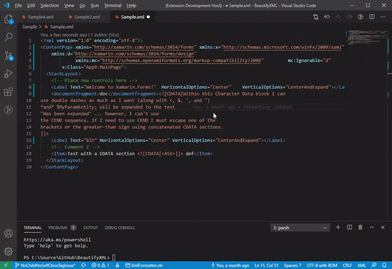
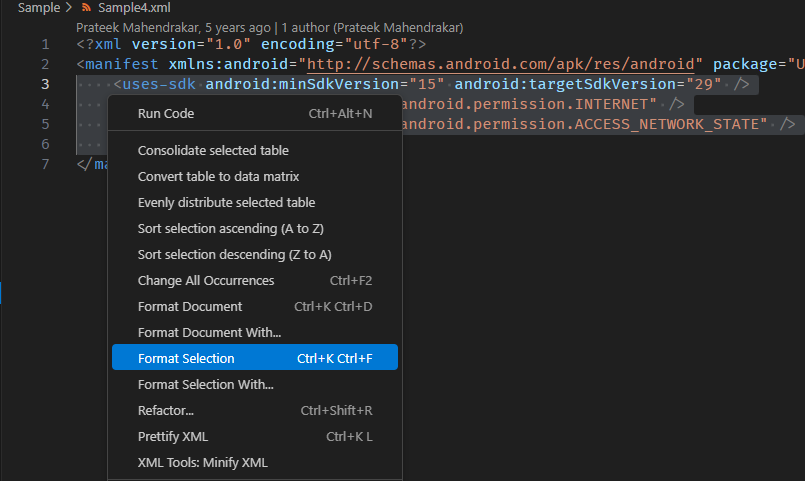
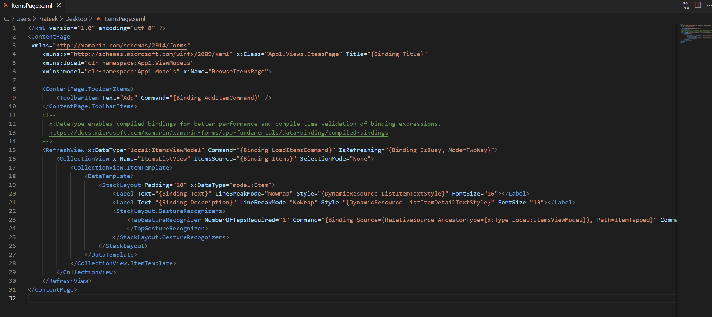
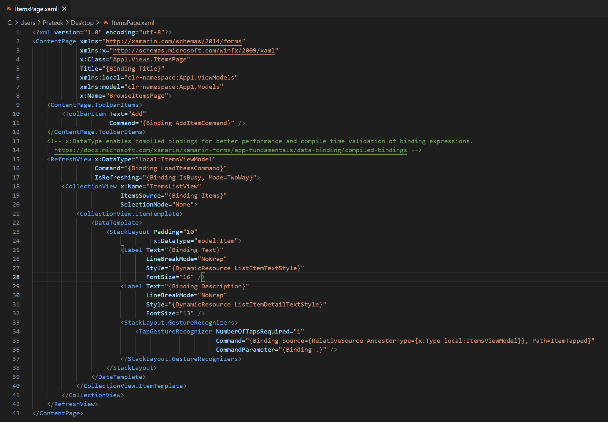
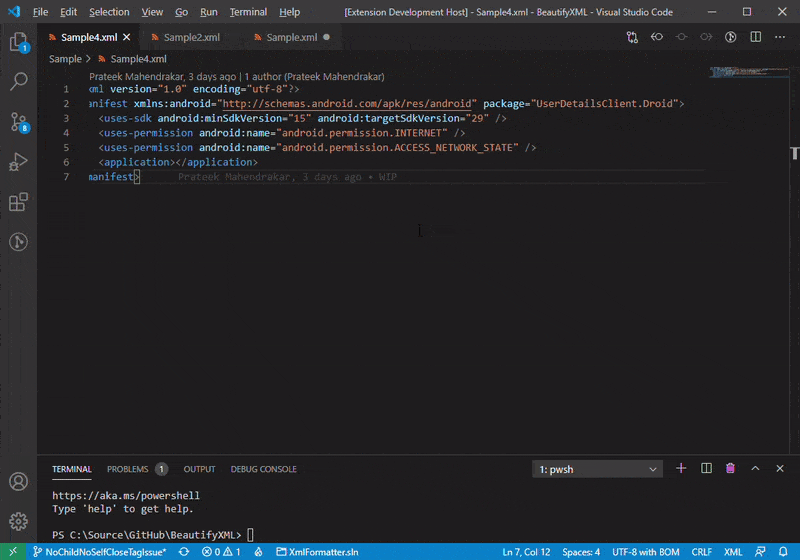
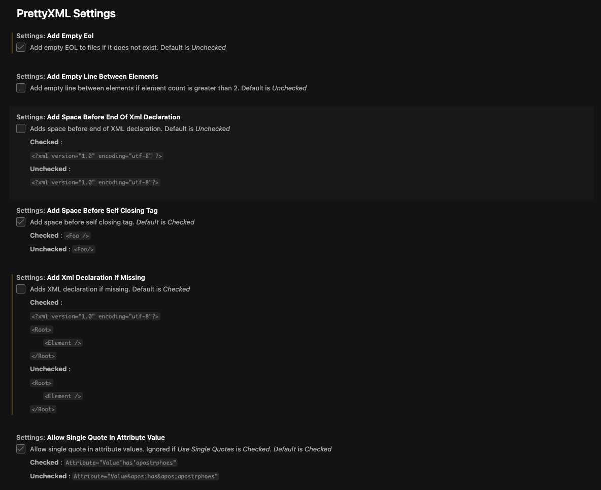

# Pretty XML

<!-- markdownlint-disable-next-line MD033 -->


[What is it?](#what-is-it)

[Features](#features)  
[1. Prettify XML (XML Formatting)](#1-prettify-xml-xml-formatting)  
[2. Pretty XML: Minimize](#2-pretty-xml-minimize)

[Keyboard Shortcuts](#keyboard-shortcuts)

[Settings](#settings)

[Requirements](#requirements)

[Installation](#installation)

[Known Issues](#known-issues)

[Change Log](CHANGELOG.md#change-log)

[For more information](#for-more-information)

## What is it?

Pretty XML is a XML formatter extension for Visual Studio Code and VSCodium. It formats XML documents just like Visual Studio on Windows.

**Supported file extensions**:

- xml
- xaml
- axml
- xsd
- xsl
- plist
- mobileconfig
- config
- csproj
- svg
- resx and all other XML type of files.

There is also **Visual Studio for Mac** version of this extension. Check it out at [PrettyXML.VSMac](https://github.com/pmahend1/PrettyXML.VSMac)

Suggestions, improvement PRs are welcome.  
<!-- License|Deploy  -->
[](https://choosealicense.com/licenses/mit/)  

<!-- Visual Studio MarketPlace: Version|Installs|Downloads|Rating -->
[](https://marketplace.visualstudio.com/items?itemName=PrateekMahendrakar.prettyxml)  

<!-- Open VSX: Version|Installs|Downloads|Rating-->
[](https://open-vsx.org/extension/PrateekMahendrakar/prettyxml)  



---

## Features

### 1. Prettify XML (XML Formatting)

Right Click and Select Prettify XML or use [shortcut](#keyboard-shortcuts)

- Position each attribute on a separate line.
- First attribute on same line as start element start tag.
- All attributes indented aligning with first attribute.
- If no child for an element then close inline end tag.
- No empty lines.
- Supports `'` and whitespace unicodes in attribute value for XAML parser compatibility.

### 1.a. Format Entire Document

- Lets you format entire valid XML document.

### 1.b. Format Selection - Beta

- Lets you format part of an XML document. XML can be partial and invalid. This is in beta, so feel free to submit pull request with improvements.


  
Before



After



### 2. Pretty XML: Minimize

Minimizes XML.



---

## Keyboard Shortcuts

| Command             | Platform       | Shortcut         |
| ------------------- | -------------- | ---------------- |
| Prettify XML        | Mac            | **Cmd+K L**      |
| Prettify XML        | Windows, Linux | **Control+K L**  |
| PrettyXML: Minimize | Mac            | **Cmd+K \`**     |
| PrettyXML: Minimize | Windows, Linux | **Control+K \`** |

> **Note**
>
> You can change these in **Preferences → Keyboard Shortcuts** if you want.

---

## Settings

These will be for **Prettify XML** command.

| Setting Key                                                                                                                                     | Default Value   | Description                                                                  |
|-------------------------------------------------------------------------------------------------------------------------------------------------|-----------------|------------------------------------------------------------------------------|
| prettyxml.settings.indentSpaceLength                                                                                                            | 4               | No. of spaces for indentation.                                               |
| prettyxml.settings.useSingleQuotes                                                                                                              | false           | Use ' instead of \"                                                          |
| prettyxml.settings.useSelfClosingTag                                                                                                            | true            | If no child nodes then self closing tag />                                   |
| prettyxml.settings.formatOnSave                                                                                                                 | false           | Enable format on save                                                        |
| prettyxml.settings.allowSingleQuoteInAttributeValue                                                                                             | true            | Allows ' in attribute values instead of \&apos;                              |
| prettyxml.settings.addSpaceBeforeSelfClosingTag                                                                                                 | true            | Adds space before self closing tag                                           |
| prettyxml.settings.wrapCommentTextWithSpaces                                                                                                    | true            | Wraps comment text with a single space                                       |
| prettyxml.settings.allowWhiteSpaceUnicodesInAttributeValues                                                                                     | true            | Allows white space unicodes in attribute values                              |
| prettyxml.settings.positionFirstAttributeOnSameLine                                                                                             | true            | Position first attribute on same line.                                       |
| prettyxml.settings.positionAllAttributesOnFirstLine                                                                                             | false           | Position all attributes on first line                                        |
| prettyxml.settings.preserveWhiteSpacesInComment                                                                                                 | false           | Preserves whitespaces in a comment.                                          |
| prettyxml.settings.addSpaceBeforeEndOfXmlDeclaration                                                                                            | false           | Add space before end of XML declaration.                                     |
| [prettyxml.settings.addXmlDeclarationIfMissing](#add-xml-declaration-if-missing)                                                                | true            | Add XML declaration if missing.                                              |
| [prettyxml.settings.attributesInNewlineThreshold](#attributes-in-newline-threshold)                                                             | 1               | Attributes count threshold to position attributes in newlines.               |
| prettyxml.settings.enableLogs                                                                                                                   | false           | Enables logs                                                                 |
| [prettyxml.settings.wildCardedExceptionsForPositionAllAttributesOnFirstLine](#wild-carded-exceptions-for-position-all-attributes-on-first-line) | Array\<string\> | Wild card exceptions for elements to ignore positionAllAttributesOnFirstLine |
| [prettyxml.settings.addEmptyLineBetweenElements](#add-empty-line-between-elements)                                                              | false           | Add empty line between elements if the child count is greater than 2         |
| [prettyxml.settings.addEmptyEol](#add-empty-eol)                                                                                                | false           | Add empty EOL to files if it does not exist.                                 |
| [prettyxml.settings.preserveNewLines](#preserve-new-lines)                                                                                      | false           | Preserve existing new lines between elements.                                |
| [prettyxml.settings.preserveCommentPlacement](#preserve-comment-placement)                                                                      | false           | Preserve comment line placement.                                             |



### Attributes In Newline Threshold

Example:

Value = 2

#### Input 1

```xml
<Element Attribute1="Value1" Attribute2="Value2" />
```

#### Output 1

```xml
<Element Attribute1="Value1" Attribute2="Value2" />
```

#### Input 2

```xml
<Element Attribute1="Value1" Attribute2="Value2" Attribute3="Value3" />
```

#### Output 2

```xml
<Element Attribute1="Value1"
         Attribute2="Value2"
         Attribute3="Value3"/>
```

### Wild Carded Exceptions For Position All Attributes On First Line

List of element names to ignore Position All Attributes On First Line setting. Include element names or patterns here.

Example:

```json
 "prettyxml.settings.wildCardedExceptionsForPositionAllAttributesOnFirstLine": ["Content*"]
```

#### Input 3

```xml
<View>
    <Content X="X"
             Y="Y" Z="Z">
        <Label text="{i18>LabelText}" />
        <Input id="Input1" 
               value="{service>description}" />
    </Content>
</View>
```

#### Ouput 3

```xml
<View>
    <Content X="X"
             Y="Y"
             Z="Z">
        <Label text="{i18>LabelText}" />
        <Input id="Input1" value="{service>description}" />
    </Content>
</View>
```

### Add Empty Line Between Elements

If enabled, and child elements count is greater than 2 then adds empty line between elements.

> [!NOTE]  
> Please note it wont add empty element before first element and after last element.

#### Input 4

```xml
<Root>
<Element1>Text1</Element1>
<Element2>Text2</Element2>
<Element3>Text3</Element3>
</Root>
```

#### Output 4

```xml
<Root>
    <Element1>Text1</Element1>

    <Element2>Text2</Element2>

    <Element3>Text3</Element3>
</Root>
```

### Add Xml Declaration If Missing

Adds XML declaration `<?xml version="1.0" encoding="utf-8"?>` if missing.
Default is `true`.

### Preserve New Lines

Preserves existing new lines between elements.

Example: Value = **false**

#### Input 5

```xml
<Root>
      <Element1>Text1</Element1>


    <Element2>Text2</Element2>

        <Element3>Text3</Element3>
    <Element3>Text4</Element3>
</Root>
```

#### Output 5

```xml
<Root>
    <Element1>Text1</Element1>
    <Element2>Text2</Element2>
    <Element3>Text3</Element3>
    <Element3>Text4</Element3>
</Root>
```

Example: Value = **true**

#### Input 6

```xml
<Root>
      <Element1>Text1</Element1>


    <Element2>Text2</Element2>

        <Element3>Text3</Element3>
    <Element3>Text4</Element3>
</Root>
```

#### Output 6

```xml
<Root>
    <Element1>Text1</Element1>

    
    <Element2>Text2</Element2>
        
    <Element3>Text3</Element3>
    <Element3>Text4</Element3>
</Root>
```

### Preserve Comment Placement

Preserve existing comment line placement. Default is *Unchecked*

**Checked** : Comments remains in their original lines.
**Unchecked** : Comments may be repositioned into other lines according to formatting rules.

Example: Value = **false**

#### Input 7

```xml
<Root>
    <Element1>Text1</Element1>  <!--A comment-->
    <Element2>Text2</Element2><!--Another comment-->
    <Element3>Text3</Element3>
</Root>
```

#### Output 7

```xml
<Root>
    <Element1>Text1</Element1>
    <!--A comment-->
    <Element2>Text2</Element2>
    <!--Another comment-->
    <Element3>Text3</Element3>
</Root>
```

Example: Value = **true**

#### Input 8

```xml
<Root>
    <Element1>Text1</Element1>    <!--A comment-->
    <Element2>Text2</Element2>   <!--Another comment-->
    <Element3>Text3</Element3>
</Root>
```

#### Output 8

```xml
<Root>
    <Element1>Text1</Element1><!--A comment-->
    <Element2>Text2</Element2><!--Another comment-->
    <Element3>Text3</Element3>
</Root>
```

### Add Empty EOL

Adds an empty line (trailing newline) at the end of formatted files if one does not exist.

Default is `false` (*Unchecked*).

- **Checked (`true`)**: Ensures the formatted document ends with a trailing newline (matching CRLF or LF based on the file).
- **Unchecked (`false`)**: Preserves the original file's trailing line ending without forcing one if it did not exist.

---

## Requirements

- [**DotNet 10**](https://dotnet.microsoft.com/en-us/download/dotnet) installed on your machine and should be accessible through terminal.
- Install [Muhammad-Sammy C#](https://open-vsx.org/extension/muhammad-sammy/csharp) or [Microsoft C#](https://marketplace.visualstudio.com/items?itemName=ms-dotnettools.csharp) extension.
- Visual Studio Code/VSCodium 1.99.1 or higher.

---

## Installation

Visual Studio Code - [Visual Studio MarketPlace](https://marketplace.visualstudio.com/items?itemName=PrateekMahendrakar.prettyxml)

For VSCodium - [open-vsx.org](https://open-vsx.org/extension/PrateekMahendrakar/prettyxml)

---

## Known Issues

- Limited DTD support.
- Formats valid XML files only. Syntax errors are displayed.

Issues can be reported at [issues section](https://github.com/pmahend1/PrettyXML/issues)

---

### For more information

- [Source Code](https://github.com/pmahend1/prettyxml)
- If you want to support this project,  <!-- markdownlint-disable-next-line MD033 -->
    [](https://www.buymeacoffee.com/pmahend1)
