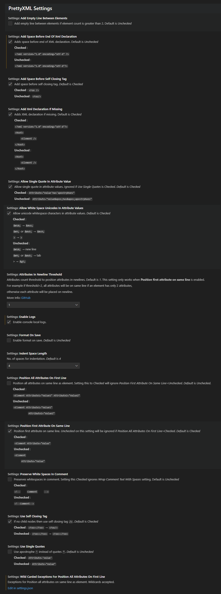

# Pretty XML


[What is it?](#what-is-it)

[Features](#features)  
[1. Prettify XML (XML Formatting)](#1-prettify-xml-xml-formatting)  
[2. Pretty XML: Minimize](#2-pretty-xml-minimize)

[Keyboard Shortcuts](#keyboard-shortcuts)

[Settings](#settings)

[Requirements](#requirements)

[Installation](#installation)

[Known Issues](#known-issues)

[Change Log](CHANGELOG.md#change-log)

[For more information](#for-more-information)

## What is it?

Pretty XML is a XML formatter extension for Visual Studio Code and VSCodium. It formats XML documents just like Visual Studio on Windows.

**Supported file extensions**:

- xml
- xaml
- axml
- xsd
- xsl
- plist
- mobileconfig
- config
- csproj
- svg
- resx and all other XML type of files.

There is also **Visual Studio for Mac** version of this extension. Check it out at [PrettyXML.VSMac](https://github.com/pmahend1/PrettyXML.VSMac)

Suggestions, improvement PRs are welcome.  
<!-- License|Deploy  -->
[](https://choosealicense.com/licenses/mit/)  

<!-- Visual Studio MarketPlace: Version|Installs|Downloads|Rating -->
[](https://marketplace.visualstudio.com/items?itemName=PrateekMahendrakar.prettyxml)  

<!-- Open VSX: Version|Installs|Downloads|Rating-->
[![Open VSX](https://img.shields.io/open-vsx/v/PrateekMahendrakar/PrettyXML?color=darkcyan&logoColor=green&style=for-the-badge&logo=data:image/png;base64,iVBORw0KGgoAAAANSUhEUgAAACAAAAAgCAYAAABzenr0AAAAAXNSR0IArs4c6QAAAARnQU1BAACxjwv8YQUAAAAJcEhZcwAADsMAAA7DAcdvqGQAAAZbSURBVFhHtZdpTFRXFMf/783AsO/KNiCLiIiC2ioatbVIi4paV2pso9ZGU5u2SdsPTTW1sZrYfjA2bWODhtimcQ0oLtVapYjWWkFUqOLKJsPmIAgIDAzM6zmXB1IZYEj0x4d599z3uOfe8z/n3iuhLzJiYhx9FswZBXfXAEnWOEga6ABNV69FsfbNU2RJEb+dnaCHNsXSaUJDU2XtsVN3UVDQSj0W0a/S+59JnuvX6+1jIzdC55gsyZKnan8uKBalHibTQfPdwq11O1Iq2cT2bgckz81fTtEFBR6GRvZTbS8EpbOzylxeuajuqy053BTrSjMP0kVFnH3RgzOSLLvKri5JOj/9gda8vCaZbLJY9ucw+OfjX8aml+IgSQPLRNJo/LXjo76gR1kIjmPe1TU03OztsWXSVLjbk0aJNaOjsT46BtGeXqI9EJLOYTn8/R1kVrstgouif+psZ6e2unDUaMWgKyIiRfvfulrxa7b8T+hWkTSyt+fqFWEyp5pq6xce+Oy8xTi3YCmCXVyFbVl4BMLd3ZFRWoSEwGBhK3hUi7o2E+43PBbtwbBz9/KXOc/VtlW0FKVmsxn779+B3tkFu19NgIZiHB8QhEOvJ+GfmmpM8BkmwvG4vQ2/lZWgU+kqBYOihTM5INurTatkzl+MfQlz8M21K0g+cxIB5MSi0JHYejUHD5404f0x4/CHoQwz/ALh5+SM9OL76pc2QLGXqRxwJvTLhst/I8bLB0dnz4extQU7b+YjmZa/ovkJEk8cQQHF/TVajQR9EEa6eSDHWKN+OTiKxUIODMLF6krEHTmAn+8UIu2NefgkZiImDfelMMhoMrfjgwtZOF9VgaVhEShpaoBi6/KrDOoAwxrYfesG5p7MQEuHGQ6kfl8nR9HHA27KvSTqamF9HeKG+wmB2sqADrwVPgrDHZ3UFkTMN1JIGB05wUR7eQvx5TysFo6+FxVN+5WCH6bPxLuUooyPgyNWjooSz8/SxwGuYvGBQbDXaDDdPxCTaUbrosb1FJvfy0tFqrXTbsd8P22meOf243qMoVrxir8eZwwPMMLVDZ/GTBBZtHnSFGyLmwZHbZfTvenjgBPN7Nu46dg0MU60/ZycMJ7SLNbbR7Q5xYobG2A08c7KK6FBEeW9iRxaGzUWl2qq0NjejtRbN8XMl1DGLAwJx7lKA1o7OsQ3venjQDPFOOFEOkLd3BDj7Q0/CgHnOC9/NzwArwAPzr8GyggPeodnm1FSJN45VlosCtPXVKpZH5zG1rCqgQYaYN35TDpbyJg7IhQBlN+lTY2iL8LdQzjJvBMxGsfLisUzF6knpAGuCYxCfzxrdn7P7Zs9ZfpZ+hUhC2pr3mWEUiw57t0sI2E6ae1E/U+m55TCG8Ie6eGFkw9KepaZV2OaX4AI17ZrucJmjX4dYDIrysVq3KqvVy0QQptFIhWbUOYpkZYsONZKmloFWcA/zYhHrI+PqBEbJk6Gq531giv3nOGs0EG72lXjQ6GHbkpoRvzBuuxMPDKZhC0pOARVLc2iaPFAe2fNxjwKnZZCuDpyDJXucCrhzuLdZ5GlTmnAvTO7yoAPx8aK5WT23rstttualhbR5vRcS2nKe4C3zgHpiUmY4D0M3xVcQ/zxdITt24OxB3/FHUpTa0jDtm9bpvHxPqS2++BCW3FG4nxRcPJJ1ddrjUgMCkY17QsXaHlnB4UIYa768zTl+1RKUwvezjyNMlW0A2GpfbSYHVhCDqSpNquwoLjEBpLSOd3G0QwXhoQJO8Pq58xgZxOOH+7JmMGwGI2LZKXD3FVRBoC1wPE9VHQXu2hP+OivLHx8MVvt7VolX6oXP97It3lwQUdHsyw1tVeozSFxlE5CjbQbdsMi3KWmpK2Y6+orZWNq6j3al+tUm83whpNHGcJwef7s0nmRkrZCYxrr96UVy6iqMimtrQdU+5DYnp8nqt2arDPIqjCoVttQTKb9MBja+GKi6PQh+XKg73JJkrtOnDbCy87pV0S1YSjQ7cigXL+ysiU3X1xMUJeSUtlRWv4mXST5zvZC4cE7S8oWGnf+Is5u6pUXaM2+UOWg990veXjqoNWE0Wo8PYk8BzjmFOpUS27Bqtod399jE9utX8/1eh1fGuxcnAOg1Trz6ZUPkGq/TdBpmzZEi8KpxmpnwXHMqatX5QX+A7NfiweMOpOSAAAAAElFTkSuQmCC)](https://open-vsx.org/extension/PrateekMahendrakar/prettyxml)  


---

## Features

### 1. Prettify XML (XML Formatting)

Right Click and Select Prettify XML or use [shortcut](#keyboard-shortcuts)

- Position each attribute on a separate line.
- First attribute on same line as start element start tag.
- All attributes indented aligning with first attribute.
- If no child for an element then close inline end tag.
- No empty lines.
- Supports `'` and whitespace unicodes in attribute value for XAML parser compatibility.

**before**


**After**


### 2. Pretty XML: Minimize

Minimizes XML.


---

## Keyboard Shortcuts

| Command             | Platform       | Shortcut         |
| ------------------- | -------------- | ---------------- |
| Prettify XML        | Mac            | **Cmd+K L**      |
| Prettify XML        | Windows, Linux | **Control+K L**  |
| PrettyXML: Minimize | Mac            | **Cmd+K \`**     |
| PrettyXML: Minimize | Windows, Linux | **Control+K \`** |

> **Note**
>
> You can change these in **Preferences → Keyboard Shortcuts** if you want.

---

## Settings

These will be for **Prettify XML** command.

| Setting Key                                                                         | Default Value | Description                                                    |
|-------------------------------------------------------------------------------------|---------------|----------------------------------------------------------------|
| prettyxml.settings.indentSpaceLength                                                | 4             | No. of spaces for indentation.                                 |
| prettyxml.settings.useSingleQuotes                                                  | false         | Use ' instead of \"                                            |
| prettyxml.settings.useSelfClosingTag                                                | true          | If no child nodes then self closing tag />                     |
| prettyxml.settings.formatOnSave                                                     | false         | Enable format on save                                          |
| prettyxml.settings.allowSingleQuoteInAttributeValue                                 | true          | Allows ' in attribute values instead of \&apos;                |
| prettyxml.settings.addSpaceBeforeSelfClosingTag                                     | true          | Adds space before self closing tag                             |
| prettyxml.settings.wrapCommentTextWithSpaces                                        | true          | Wraps comment text with a single space                         |
| prettyxml.settings.allowWhiteSpaceUnicodesInAttributeValues                         | true          | Allows white space unicodes in attribute values                |
| prettyxml.settings.positionFirstAttributeOnSameLine                                 | true          | Position first attribute on same line.                         |
| prettyxml.settings.positionAllAttributesOnFirstLine                                 | false         | Position all attributes on first line                          |
| prettyxml.settings.preserveWhiteSpacesInComment                                     | false         | Preserves whitespaces in a comment.                            |
| prettyxml.settings.addSpaceBeforeEndOfXmlDeclaration                                | false         | Add space before end of XML declaration.                       |
| [prettyxml.settings.attributesInNewlineThreshold](#attributes-in-newline-threshold) | 1             | Attributes count threshold to position attributes in newlines. |
| prettyxml.settings.enableLogs                                                       | false         | Enables logs                                                   |



### Attributes In Newline Threshold

Example:

Value = 2

#### Input#1

```xml
<Element Attribute1="Value1" Attribute2="Value2" />
```

#### Output#1

```xml
<Element Attribute1="Value1" Attribute2="Value2" />
```

#### Input#2

```xml
<Element Attribute1="Value1" Attribute2="Value2" Attribute3="Value3" />
```

#### Output#2

```xml
<Element Attribute1="Value1"
         Attribute2="Value2"
         Attribute3="Value3"/>
```

---

## Requirements

- [**.Net 6** or later](https://dotnet.microsoft.com/en-us/download/dotnet) installed on your machine and should be accessible through terminal.
- Install [Muhammad-Sammy C#](https://open-vsx.org/extension/muhammad-sammy/csharp) or [Microsoft C#](https://marketplace.visualstudio.com/items?itemName=ms-dotnettools.csharp) extension.
- Visual Studio Code/VSCodium 1.59 or higher.

---

## Installation

Visual Studio Code - [Visual Studio MarketPlace](https://marketplace.visualstudio.com/items?itemName=PrateekMahendrakar.prettyxml)

For VSCodium - [open-vsx.org](https://open-vsx.org/extension/PrateekMahendrakar/prettyxml)

---

## Known Issues

- Limited DTD support.
- Formats valid XML files only. Syntax errors are displayed.

Issues can be reported at [issues section](https://github.com/pmahend1/PrettyXML/issues)

---

### For more information

- [Source Code](https://github.com/pmahend1/prettyxml)
- If you want to support this project,  
    [](https://www.buymeacoffee.com/pmahend1)
